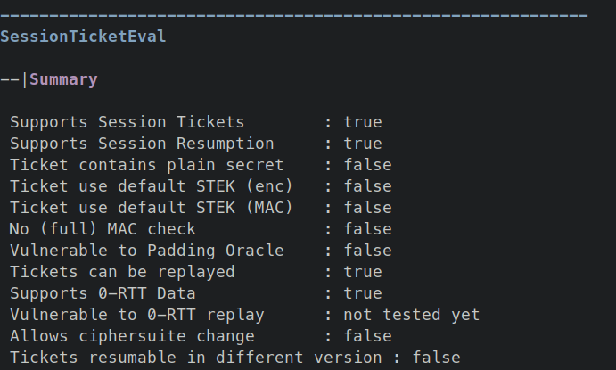
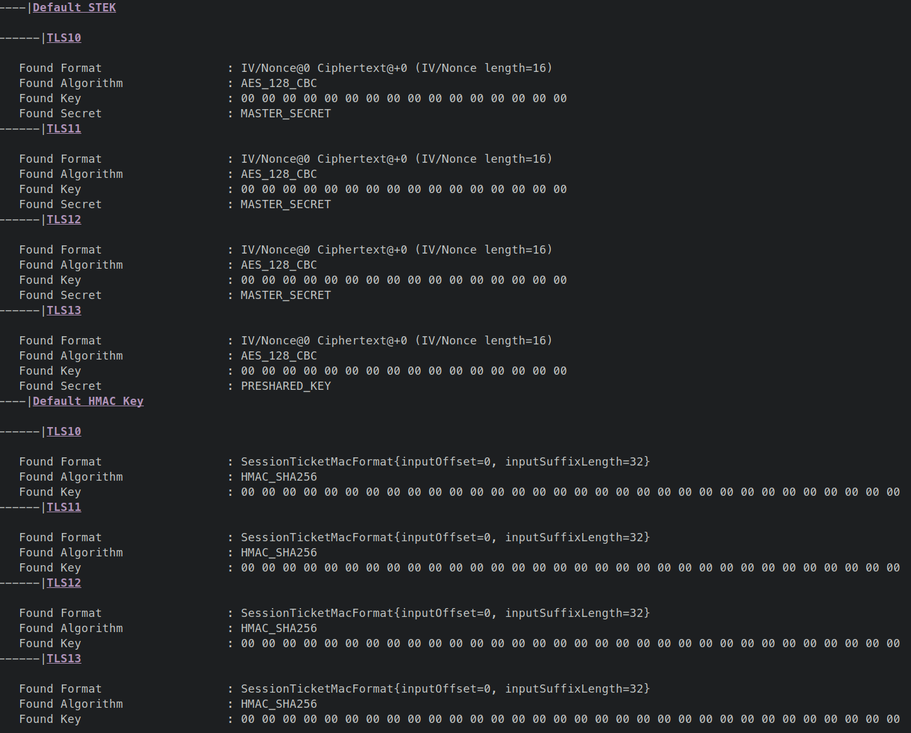
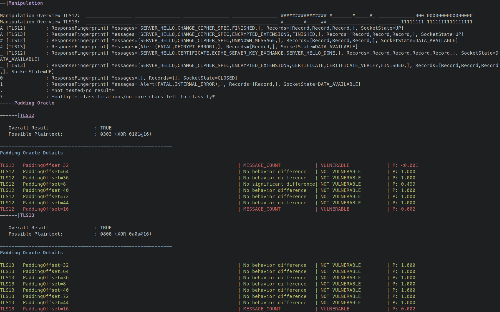

# We _Really_ Need to Talk About Session Tickets

Session tickets improve the TLS protocol performance and are therefore widely used. For this, the server encrypts secret state and the client stores the ciphertext and state. Anyone able to decrypt this ciphertext can passively decrypt the traffic or actively impersonate the TLS Server on resumption. To estimate the dangers associated with session tickets, we perform the first systematic large-scale analysis of the cryptographic pitfalls of session ticket implementations.

We found significant differences in session ticket implementations and critical security issues in the analyzed servers. Vulnerable servers used weak keys or repeating keystreams in the used tickets. Among others, our analysis revealed a widespread implementation flaw within the Amazon AWS ecosystem that allowed for passive traffic decryption for at least 1.9% of all servers in the Tranco Top 100k servers.

This repository contains the code we used to perform our wide-scan Analysis.
_This is a standalone version of our code, which we will merge into [TLS-Scanner] and [TLS-Anvil] in the future. The code is also available on the [TLS-Scanner sessionticket-ae branch](https://github.com/tls-attacker/TLS-Scanner/tree/sessionticket-ae). This repository contains that branch as a submodule._

## Publications

- [Technical Paper] [*We Really Need to Talk About Session Tickets: A Large-Scale Analysis of Cryptographic Dangers with TLS Session Tickets*](https://www.usenix.org/conference/usenixsecurity23/presentation/hebrok);
Sven Hebrok, Simon Nachtigall, Marcel Maehren, Nurullah Erinola, Robert Merget, Juraj Somorovsky, Jörg Schwenk;
Usenix Security 2023
- [Blog Post] [We Really Need to Talk About Session Tickets](https://upb-syssec.github.io/blog/2023/session-tickets/);
Sven Hebrok;
2023
- [Twitter Thread] [In our newest USENIX paper [we] took a look at the TLS session ticket deployment in the wild and found diverse vulnerabilities](https://twitter.com/jurajsomorovsky/status/1648669039844028416); Juraj Somorovsky

## Presentations

- RuhrSec 2023 (video and slides TBA)

## Am I Affected? / Using this Artefact


To check whether you are affected, the best thing to do is to actually check the keys used on your server.
The second-best thing is to use our scanner.
We extended [TLS-Scanner] to include tests for the vulnerabilities presented in our paper.
You first need to build the scanner (or get its docker image) and then run it against your server.
To run the scanner against a host (including port) you need to provide the  `-connect [host]` parameter.
In addition you can specify `-scanDetail NORMAL` to change how thorough the tests should be.
A higher detail takes more time, but might reveal more issues.
We used `DETAILED` for our experiments, but `NORMAL` should be sufficient for most cases.

### Running with Docker

To run the scanner using docker, you have two options:
Build the docker image locally, or use the prebuilt image from [dockerhub](https://hub.docker.com/r/snhebrok/tls-scanner-ae).
- To build the docker image yourself, use `docker build` from within TLS-Scanner.
- To use the prebuilt image, simply use `docker run` which will download the image.

```sh
# only if you want to build the image yourself
cd TLS-Scanner && docker build -t snhebrok/tls-scanner-ae .
# run the scanner (also pulls the image if it does not exist)
docker run --rm -it snhebrok/tls-scanner-ae -connect [host] -scanDetail NORMAL
```

If you just want to use the tool itself, and not evaluate a specific server, take a look at the [test server we provide](#test-server-setup) below.

**NB:** When using docker, `127.0.0.1` is not the localhost of your host machine. That is, you do not reach servers you have running on your PC this way. You have to use `172.17.0.1` (or any other IP address of your host machine) instead.

### Running from Source

To run the scanner from source, you need to have Java 11 and maven installed.
For more details about the TLS-Attacker projects, we recommend looking at the [TLS-Attacker-Description] repository.
To compile the scanner use maven:

```sh
cd TLS-Scanner
mvn clean package -DskipTests=true
java -jar apps/TLS-Server-Scanner.jar -connect [host] -scanDetail NORMAL
```

If you just want to use the tool itself, and not evaluate a specific server, take a look at the [test server we provide](#test-server-setup) below.

**If you encounter errors, check that you are using Java 11.**
`java --version` should return something like `openjdk 11.0.19`.

### Interpreting the Output Summary



The scanner summarizes the most relevant information under `SessionTicketEval`>`Summary`.
If your server does not support session tickets, that server is safe.
If it does support session tickets, the following properties should be `false`:
- `Ticket contains plain secret`
    - If `true`, the scanner found a sensitive session secret in a ticket sent by the server. In TLS 1.2 this means, that any network adversary can read this secret directly.
- `Ticket use default STEK (enc)`
    - If `true`, the scanner found the key and format to decrypt a ticket. The key (STEK) should always be chosen randomly. Again, a network adversary can recover the secret.
- `Ticket use default STEK (MAC)`
    - If `true`, the scanner found the key and format to compute the mac for a ticket. The key (STEK) should always be chosen randomly. This might allow an attacker to modify a session ticket and mount different attacks, like a padding oracle attack. In any case this indicates an underlying issue.
- `No (full) MAC check`
    - If `true`, the scanner determined, that the server does not fully ensure the authenticity of the ticket. This might allow an attacker to modify a session ticket and mount different attacks, like a padding oracle attack. In any case this indicates an underlying issue.
- `Vulnerable to Padding Oracle`
    - If `true`, the scanner was able to determine the last two plaintext bytes of the ticket by abusing a padding oracle attack. This means an attacker could use a full padding oracle attack to decrypt session tickets, and again recover the contained secret.

The scanner also outputs further information about the tested and discovered issues.
We show two examples in the artefact evaulation experiments below.

## Artefact Evaluation Experiments

For the Artefact Evaluation we propose two experiments to show that we can detect default key material, as well as ticket authentication issues including padding oracle vulnerabilities.
To run the experiments, you need to have a server running.
Our experiments provide the expected output of the scanner when run against the vulnerable test server.
If you run it against your server, the output should hopefully say that no issue was found.

### Test Server setup

To run the test server, you can either run it from source, or use docker.

#### Building from Source

To build the test server, we refer you to the [BUILDING.md](testserver/BUILDING.md) contained in the testserver directory.

#### Building with Docker

To run the test server using docker, you have two options:
Build the docker image locally, or use the prebuilt image from [dockerhub](https://hub.docker.com/r/snhebrok/vulnerable-bssl/tags).
- To build the docker image yourself, use `docker build` from within TLS-Scanner.
- To use the prebuilt image, simply use `docker run` which will download the image.

```sh
# only if you want to build the image yourself
cd testserver && docker build -t snhebrok/vulnerable-bssl:sessionticket-ae .
# you don't need to do anything here if you want to use the prebuilt image, but can still pull it explicitly
docker pull snhebrok/vulnerable-bssl:sessionticket-ae
```

**NB:** When using docker, `-p8000:8000` maps the port 8000 of the container to the port 8000 of the host. This way, the server is reachable at `localhost:8000`.

**NB:** When using docker, Control+C does not work; you'll have to kill the container using `docker kill [container-id]`.


### E0: Basic Experiment Structure

For all experiments you need to run the scanner against the TLS server.
Depending on the experiment, the server needs to be configured differently.
We'll provide a complete command to run the server for each experiment (using docker).
When the server is running, start the scanner:

```sh
# from source
java -jar apps/TLS-Server-Scanner.jar -connect 127.0.0.1:8000 -scanDetail NORMAL
# with docker
docker run --rm -it snhebrok/tls-scanner-ae -connect 172.17.0.1:8000 -scanDetail NORMAL
```

This assumes that the testserver is running on your host machine (`127.0.0.1` from your host, or `172.17.0.1` from within docker).
When using docker, this _should_ be `172.17.0.1`.
If this does not work, take a look at your IP configuration.

### E1: Detecting default keys (5 human-minutes + 5 compute-minutes)

**Setup** Run the test server with the following parameters:
```sh
docker run --rm -it -p8000:8000 snhebrok/vulnerable-bssl:sessionticket-ae s_server -accept 8000 -loop -www \
    -ticketEnc AES-128-CBC -ticketEncKey 00 \
    -ticketHMac SHA256 -ticketHMacKey 00 -ticketHMacKeyLen 32
```

**Expected Result** The scanner should report the following:
```
Ticket use default STEK (enc)	 : true
Ticket use default STEK (MAC)	 : true
```
Further down, you'll find details about the discovered STEK, contained secret, algorithm, and format.



**Manual Attack using OpenSSL**
You can also perform this attack manually using OpenSSL to validate the result of the scanner.
For this you have to perform three steps:


1. Connect to the server and store the session state
    - `openssl s_client -connect [host] -sess_out /tmp/session.cache`
    - You can connect via TLS 1.2 by passing `-tls1_2`.
    - For TLS 1.3 you might need to send `GET / HTTP/1.1` to the server before getting a ticket.
2. Inspect the stored session and take note of the associated secret.
    - `Resumption PSK` (TLS 1.3)/`Master-Key` (TLS1.2)
    - `openssl sess_id -noout -text -in /tmp/session.cache`
3. Decrypt the session ticket.
```sh
openssl sess_id -noout -text -in /tmp/session.cache | grep '[[:space:]]00' | \
    cut -f 7-21 -d" " | sed 's/[^a-f0-9]//g' | tr -d '\r\n' | cut -c1- | \
    xxd -r -p | openssl aes-128-cbc -d -K '00' -iv  '00' -nopad -v -nosalt | xxd -p
```
This command extracts the session ticket from the session cache and decrypts it using openssl AES-128-CBC with a all zero key (and IV).
The decryption is then formatted as a hexdump.
This hexdump, should contain the secret from step 2.

### E2: Detecting missing authentication and padding oracles (5 human-minutes + 15 compute-minutes)

**Setup** Run the test server with the following parameters:
```sh
docker run --rm -it -p8000:8000 snhebrok/vulnerable-bssl:sessionticket-ae s_server -accept 8000 -loop -www \
    -ticketEnc AES-256-CBC -ticketHMac None
```

**Expected Result** The scanner should report the following:
```
No (full) MAC check		 : true
Vulnerable to Padding Oracle	 : true
```

Further down, you'll find details about the server's behavior when modifying the ticket and when trying to run a padding oracle attack.

The section *Manipulation* covers the behaviour when indusing bitflips into the ticket.
Several behaviors are pre-classified:

- `A`: The modified ticket was accepted. The authenticity of the ticket was hence not verified (completely).
- `#`: The modified ticket was accepted, but key material unknown to the scanner was used. That is, the server recovered some corrupted key material from the modified ticket.
- `_`: The modified ticket was rejected, and a normal handshake was performed. **This is the expected good behavior.** This should be the case if the authenticity of the ticket is properly ensured.
- All other characters are explained in the output.

Further down is a subsection *Padding Oracle* which contains details stating at which position the oracle was found.
This also includes the recovered plaintext, as well as what value was XOR-ed at which position to recover this value.
For example, `0303 (XOR 0101@16)` means that the last two bytes of the plaintext are `0303`.
This was determined by XOR-ing `0101` with an offset of 16 from the back and observing that the server's behavior.

This behavior is summarized further down for each offset (when modifying the last byte).
Note that multiple offsets might show different behavior, but not all are necessarily a valid padding oracle vulnerability.
This is internally verified by trying to recover the second byte. As the `Overall Result` is `TRUE`, this second byte was found.





## FAQ/Common Errors


`ERROR: TrustAnchorManager - Could not load TrustAnchors. This means that you are running TLS-Scanner without its submodules. If you want to evaluate if certificates are trusted by browsers you need to initialize submodules.You can do this by running the following command:'git submodule update --init --recursive'`

This message informs that certificate validation cannot be performed as trust anchors are missing.
In this context you can ignore this message.

---

`Cannot reach the Server. Is it online?`

This message informs that the server could not be reached.
That is, the port is not open.
When running the scanner from within docker, this most likely happens due to using the wrong IP address. (`127.0.0.1` is inside the docker container; use `172.17.0.1` to reach the host)

---

```
Exception in thread "main" java.lang.ExceptionInInitializerError
	at de.rub.nds.tlsscanner.serverscanner.config.ScannerConfig.createConfig(ScannerConfig.java:201)
[...]
```
Check which java version you are using. You need to use Java 11.


[TLS-Attacker-Description]: https://github.com/tls-attacker/TLS-Attacker-Description
[TLS-Scanner]: https://github.com/tls-attacker/TLS-Scanner
[TLS-Anvil]: https://github.com/tls-attacker/TLS-Anvil
